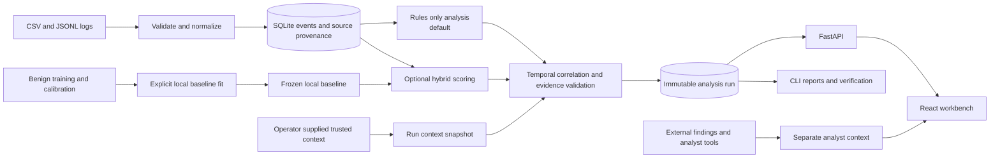

# TraceGuard

**HNX26PSI03 — AI-Powered Cyber Threat Intelligence**

TraceGuard is a local-first workbench for turning supported security logs into inspectable incident timelines. It preserves source evidence, shows uncertainty, and keeps analyst context separate from detection results.

It reconstructs observed behavior; it does not prove a person's intent or take response actions. Rules-only analysis is the default. Optional hybrid scoring requires an explicitly fitted local benign baseline.

## Capabilities

- Import documented CSV and JSONL profiles for authentication, file, device, and network events.
- Correlate supported events by exact environment-scoped identities and strict event-time order.
- Inspect timelines, entity links, risk breakdowns, source rows, partial observations, and verified JSON or Markdown reports.
- Use optional local baseline scoring, evidence comparisons, event-time replay, cases, hunts, local indicators, and selected external alert formats.
- Keep external findings and other analyst context outside native detection evidence and risk.

## Architecture



External findings do not become canonical events or create incident stages. A model score cannot supply missing evidence; for example, a removable-media transfer requires matching positive-byte copy telemetry and an active prior mount.

## Quick start

Requirements: Python 3.12, Node.js 22.12 or newer, and npm. Run commands from the repository root.

### Windows PowerShell

```powershell
git clone https://github.com/jebarson-caleb/hacknex-internal-mark-IV-302-PSI03.git
cd hacknex-internal-mark-IV-302-PSI03
py -3.12 -m venv .venv
.\.venv\Scripts\python.exe -m pip install -r backend/requirements.lock
.\.venv\Scripts\python.exe -m pip install --no-deps -e backend
npm --prefix frontend ci
npm --prefix frontend run build
.\.venv\Scripts\python.exe scripts/run_demo.py
```

### macOS and Linux

```bash
git clone https://github.com/jebarson-caleb/hacknex-internal-mark-IV-302-PSI03.git
cd hacknex-internal-mark-IV-302-PSI03
python3.12 -m venv .venv
.venv/bin/python -m pip install -r backend/requirements.lock
.venv/bin/python -m pip install --no-deps -e backend
npm --prefix frontend ci
npm --prefix frontend run build
.venv/bin/python scripts/run_demo.py
```

Open [http://127.0.0.1:8000](http://127.0.0.1:8000); the API reference is at [http://127.0.0.1:8000/docs](http://127.0.0.1:8000/docs). Stop the server with **Ctrl+C**. No API credentials or remote runtime service are required after installation. SQLite data is stored under the ignored `runtime/` directory by default.

## Try the demos

Use the workbench's seeded benign, positive, and missing-transfer datasets to inspect a clean run, a supported suspected chain, and a partial observation. These examples are synthetic. For the guided walkthrough and hybrid setup, see the [demo guide](docs/DEMO.md) and [full setup guide](full_guide.md).

## Project structure

```text
hacknex-internal-mark-IV-302-PSI03/
├── backend/src/traceguard/  # API, ingestion, storage, detection, reports
├── backend/tests/           # Backend tests
├── frontend/src/             # React and TypeScript workbench
├── frontend/tests/           # Frontend and browser tests
├── data/samples/             # Synthetic examples
├── docs/                     # Architecture, schemas, evaluation, guides
├── scripts/                  # Demo, benchmark, backup, verification
├── README.md
├── full_guide.md
└── LICENSE
```

## Verification

```powershell
.\.venv\Scripts\python.exe -m pytest backend/tests -q
npm --prefix frontend test
npm --prefix frontend run build
npm --prefix frontend run test:browser
```

## Limitations and data

This is a single-operator defensive prototype. It does not identify the human behind an account, guarantee detection quality, or replace a production SIEM. Samples are synthetic; uploaded logs and analyst context are stored locally. The proposed 1% benign false-positive target remains unmet, and the saved synthetic evaluation did not show a detection gain from hybrid scoring over rules-only analysis. See [evaluation](docs/EVALUATION.md) and [limitations](docs/LIMITATIONS.md).

## More information

[Architecture](docs/ARCHITECTURE.md) · [Input formats](docs/DATA_SCHEMA.md) · [Final release guide](docs/FINAL_RELEASE_GUIDE.md) · [Third-party resources](docs/THIRD_PARTY.md) · [MIT License](LICENSE)

Codex assisted with implementation and documentation. The project team is responsible for reviewing the source and release contents.
